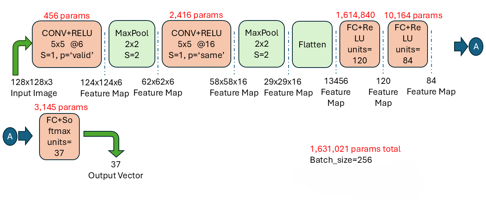

# p008-lenet-cnn-model
LeNet model and its variations is trained on OxfordiiiT pet dataset. Effect of L2 regularization and BatchNorm in tuning model is observed.
# Dataset and Split
The Oxford-IIIT pet dataset is a 37 category pet image dataset with roughly 200 images for each class. Data has 7349 images of pets and is split into 85:15 train/test data respectivle.
# Data Augmentation
Data augmentation plays important part in training model especially when data is limited. Dataset size is increased by 6 fold via augmentation techniques in file [Data_augmentation](Data_augmentation.py). Original images are concatenated with central and corners crop. Central, top left, top right, bottom left, bottom left crops are additionally processed by left_right_flip, random_hue, random_brightness, random_saturation, random_contrast; respectively. Moreover, corner crops are randomly left_right flipped using different seeds.
# LeNet Architecture
At time of LeNet, averagePool was common but now often better alternate MaxPool is used. Below is the architecture of LeNet with MaxPool modification.  
 
# LeNet and its variants experimented
LeNet archituectures are used on this data set. It is clear that this model is shallow to tackle complexities of data so poor performance. LeNet was proposed in 1998 and was used for hand written digits classification. Here, different variations of LeNet(L2 Regualarization, BatchNorm Layer, MaxPool instead of averagePool, SDG with momentum, Adam optimizier) are tested. 
  Filename indicates the variation and is explained in below table:

| filename | explanation |
|:-------|:-------|
| [1_lenet_sgd_avgpool](1_lenet_sgd_avgpool.ipynb) | Original LeNet architecture with SGD momentum optimizer |
| [1_lenet_sgd](1_lenet_sgd.ipynb) | LeNet architecture(MaxPool used) with SGD momentum optimizer |
| [1_lenet_adam](1_lenet_adam.ipynb) | LeNet architecture(MaxPool used) with Adam optimizer |
| [2_reg_sgd](2_lenet_reg_sgd.ipynb) | LeNet architecture(MaxPool used) with SGD momentum optimizer and L2 regularization |
| [2_reg_adam](2_lenet_reg_adam.ipynb) | LeNet architecture(MaxPool used) with Adam optimizer and L2 regularization |
| [3_lenet_adamw](3_lenet_adamw.ipynb) | LeNet architecture(MaxPool used) with Adam optimizer and weight decay |
| [4_lenet_bn_conv_reg_sgd](4_lenet_bn_conv_reg_sgd.ipynb) | Convolution BatchNorm LeNet architecture(MaxPool used) with SGD momentum optimizer and L2 regularization |
| [4_lenet_bn_conv_reg_adam](4_lenet_bn_conv_reg_adam.ipynb) | Convolution BatchNorm LeNet architecture(MaxPool used) with adam optimizer and L2 regularization |
| [4_lenet_bn_reg_sgd](4_lenet_bn_reg_sgd.ipynb) | BatchNorm LeNet architecture(MaxPool used) with SGD momentum optimizer and L2 regularization |
| [4_lenet_bn_reg_adam](4_lenet_bn_reg_adam.ipynb) | BatchNorm LeNet architecture(MaxPool used) with adam optimizer and L2 regularization |
| [5_lenet_bn_conv_sgd](5_lenet_bn_conv_sgd.ipynb) | Convolution BatchNorm LeNet architecture(MaxPool used) with SGD momentum optimizer |
| [5_lenet_bn_conv_adam](5_lenet_bn_conv_adam.ipynb) | Convolution BatchNorm LeNet architecture(MaxPool used) with adam optimizer |
| [5_lenet_bn_sgd](5_lenet_bn_sgd.ipynb) | BatchNorm LeNet architecture(MaxPool used) with SGD momentum optimizer |
| [5_lenet_bn_adam](5_lenet_bn_adam.ipynb) | BatchNorm LeNet architecture(MaxPool used) with adam optimizer |

**Note**: In this project, SGD optimization is always used with momentum.

# LeNet Variations Result Summary
First original LeNet architecture with SGD momentum was used to train (1_lenet_sgd_avgpool). It has average
pooling layer which is now-a-days not used. $\approx$ 14% accuracy was achieved as in file [1_lenet_sgd_avgpool](1_lenet_sgd_avgpool.ipynb). Just replacing averagePooling with Max Pooling increased accuracy to $\approx$ 16% in file [1_lenet_sgd](1_lenet_sgd.ipynb). From this, it is clear that maxPool is not only faster but also gives more accuracy so moving on only maxPooling is used in LeNet architecture. Using Adam optimizer with maxPool in Lenet increased accuracy to $\approx$ 22% as visible in file [1_lenet_adam](1_lenet_adam.ipynb). It is converges faster amd gave better result than one with sgd momentum.

Adding L2 regularization helped in not overfitting. In case of SDG with momentum and adding regularization, [2_lenet_reg_sgd](2_lenet_reg_sgd.ipynb) shows increase in accuracy from $\approx$ 16% to 18%. Using regularization with adam in [2_lenet_reg_adam](2_lenet_reg_adam.ipynb), overfitting is no more and accuracy is almost the same $\approx$ 21%. Next,adam with weight decay ,aka AdamW, is used insted of regularization in file [3_lenet_adamw](3_lenet_adamw.ipynb) and no improvement in accuracy compared to previous file..  

Now, besides regularization, LeNet architecture is modified by adding BatchNormalization to all layers or convolution layers only. [4_lenet_bn_conv_reg_sgd](4_lenet_bn_conv_reg_sgd.ipynb) increased accuracy from $\approx$ 18% to 28% while [4_lenet_bn_conv_reg_adam](4_lenet_bn_conv_reg_adam.ipynb) increased accuracy from $\approx$ 21% to 32% when compared with not using convolution BatchNorm versions. These are the best results got in different version training throughout the project.
[4_lenet_bn_reg_sgd](4_lenet_bn_reg_sgd.ipynb) made no difference to whether use BatchNorm in convolution layers or all layers. [4_lenet_bn_reg_adam](4_lenet_bn_reg_adam.ipynb) made no difference to whether use BatchNorm in convolution layers or all layers. accuracy from $\approx$ 18% to 28% while [4_lenet_bn_conv_reg_adam](4_lenet_bn_conv_reg_adam.ipynb) showed decrease in accuracy from $\approx$ 32%(when BatchNorm in convolution layer only) to 22%(when BatchNorm in all layers). 

Lastly, without regularization but with BatchNorm variations are checked.  Compared to regularization BatchNorm versions, these performed poor especially convolutional BatchNorm versions.
Interesting, adam with all layers BatchNorm and no regulariztion performed most poor than all experiments.

|  file_name.ipynb | train_acc | val_acc | reg_val | lr | epoch | train_loss | val_loss |
|:-------|:-------:|:-------:|:-------:|:-------|:-------:|:-------:|:-------:|
| [1_lenet_sgd_avgpool](1_lenet_sgd_avgpool.ipynb)    | 14.94 | 13.53 |       | 0.001,0.0001, 0.00001 | 10,5, 5 | 3.1279 | 3.1832 |
| [1_lenet_sgd](1_lenet_sgd.ipynb)                    | 17.61 | 16.26 |       | 0.001,0.0001, 0.00001 | 10,5, 5 | 3.0099 | 3.0504 |
| [1_lenet_adam](1_lenet_adam.ipynb)                  | 24.36 | 21.07 |       | 0.0001,0.00001,0.000001 | 6,6,6 | 2.7808 | 2.9439 |
| [2_reg_sgd](2_lenet_reg_sgd.ipynb)                  | 18.60 | 17.35 | 0.005 | 0.001,0.0001,0.00001 | 12,5,5 | 4.6405 | 4.6793
| [2_reg_adam](2_lenet_reg_adam.ipynb)                | 21.99 | 20.53 | 0.005 | 0.0001,0.00001, 0.000001 | 10,6, 6 | 3.4095 | 3.4806 |
| [3_lenet_adamw](3_lenet_adamw.ipynb)                | 22.73 | 20.25 |wd=0.07| 0.0001,0.00001, 0.000001 | 6,6, 6 | 2.8268 | 2.9601
| **[4_lenet_bn_conv_reg_sgd](4_lenet_bn_conv_reg_sgd.ipynb)**  | 28.80 | 28.79 | 0.005 | 0.01,0.001,0.0001, 0.00005 | 13,15,5, 5 | 2.6340 | 2.7398 |
| **[4_lenet_bn_conv_reg_adam](4_lenet_bn_conv_reg_adam.ipynb)**| 32.34| 32.15 | 0.01  | 0.001,0.00005,0.00001, 0.00001 | 10,5,5, 5 | 2.7459 | 2.8441 |
| [4_lenet_bn_reg_sgd](4_lenet_bn_reg_sgd.ipynb)      | 28.75 | 28.34 | 0.005 | 0.005,0.0001, 0.0001 | 10,6, 5 | 3.1609 | 3.2655 |
| [4_lenet_bn_reg_adam](4_lenet_bn_reg_adam.ipynb)    | 22.49 | 21.16 | 0.001 | 0.0001,0.00001, 0.000005 | 15,5, 5 | 3.2024 | 3.3188 |
| [5_lenet_bn_conv_sgd](5_lenet_bn_conv_sgd.ipynb)    | 15.25 | 15.26 | | 0.001,0.01,0.0005, 0.0005 | 5,15,10, 10 | 3.0039 | 3.1278 |
| [5_lenet_bn_conv_adam](5_lenet_bn_conv_adam.ipynb)  | 12.51 | 13.26 | | 0.0001,0.0005,0.00001, 0.000005 | 10,10,5, 5 | 3.1399 | 3.2044 |
| [5_lenet_bn_sgd](5_lenet_bn_sgd.ipynb)              | 24.45 | 25.34 | | 0.005,0.0001,0.00005,0.00001 | 10,6,6,6 | 2.6621 | 2.6816 |
| [5_lenet_bn_adam](5_lenet_bn_adam.ipynb)            | 25.29 | 24.70 |  | 0.0005,0.00005,0.00001, 0.000005 | 5,5,5, 5 | 2.6709 | 2.7468 |

